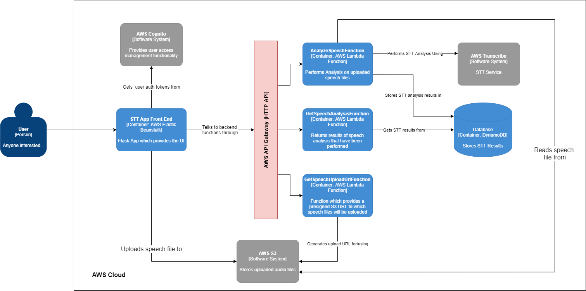
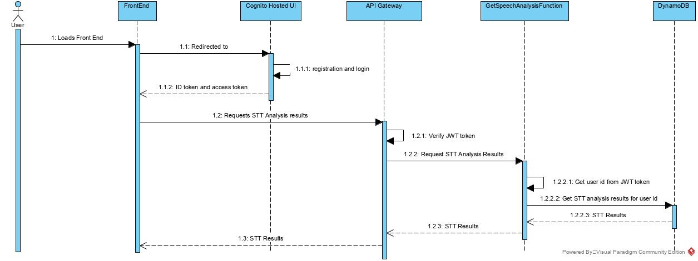
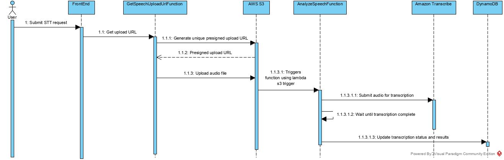
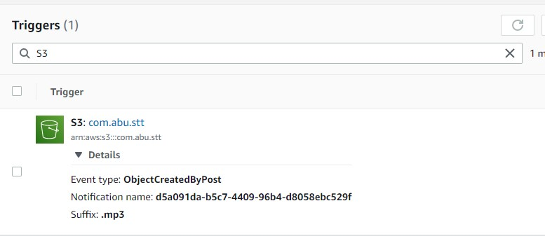
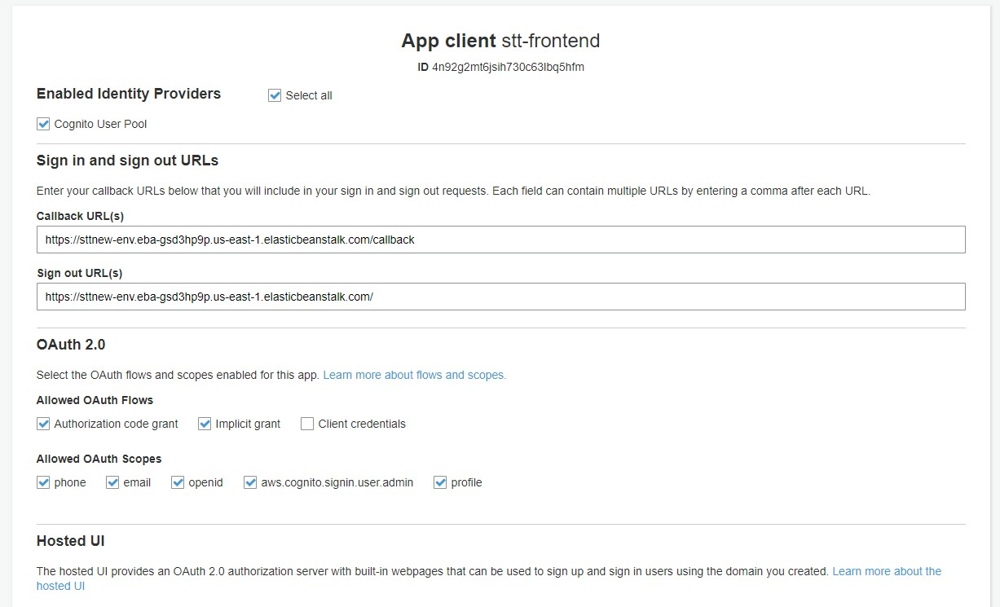
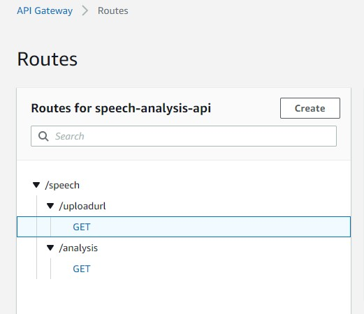
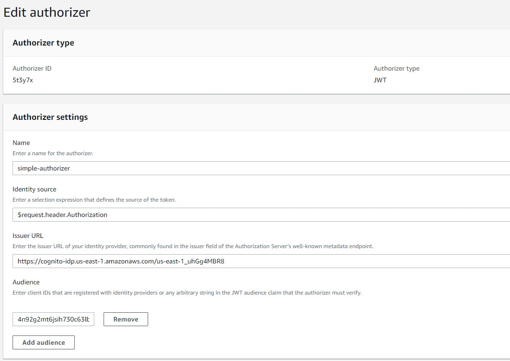
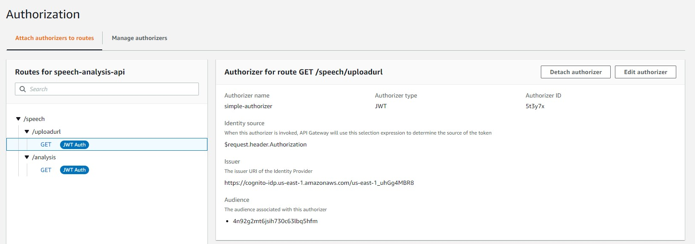
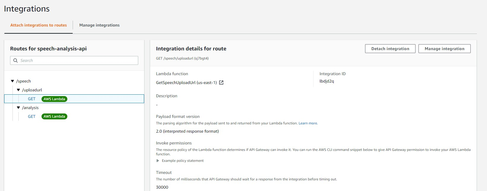

# Python Speech to Text Exercise

### Assumptions

- Since we're mostly concerned with audio files, the required format was changed to .mp3
- Users should only be able to view STT analysis results for the files they have uploaded


## Architecture

### Container Diagram


<br/>
<br/>

### High level sequences

<br/>

#### Authentication and View Results Flow


#### Speech Analysis Flow



### Deployment Instructions

#### Backend

##### GetSpeechUploadUrlFunction
1. Create a lambda function with the Python 3.8 runtime
2. Edit the service role for the function and provide it AmazonS3 Access (full access)
3. Package the lambda_function.py along with all the dependencies in a .zip file and upload
    - optionally, you can use the zip_up.ps1 script to do this
4. Upload the package to the function

##### AnalyzeSpeechFunction
1. Create a lambda function with the Python 3.8 runtime
2. Edit the service role for the function and provide it:
    - AmazonS3 Access (full access)
    - DynamoDB Access (full access)
    
3. Package the lambda_function.py along with all the dependencies in a .zip file and upload
    - optionally, you can use the zip_up.ps1 script to do this
4. Upload the package to the function
5. <b>Increase the timeout to at-least 3 minutes</b>
    - Note: audio files longer than 1 minute have not been tested with this setup, you may need to 
    increase the timeout further.
6. Add a S3 trigger to the function with the following configuration:

    

##### GetSpeechAnalysisFunction
1. Create a lambda function with the Python 3.8 runtime
2. Edit the service role for the function and provide it:
    - DynamoDB Access (full access)
3. Package the lambda_function.py along with all the dependencies in a .zip file and upload
    - optionally, you can use the zip_up.ps1 script to do this
4. Upload the package to the function

##### AWS Cognito
1. Create a new user pool
2. Make the name attribute mandatory for users
3. Choose email as the identification method
4. Create an app client (represents the front-end app)
    - Configure as follows (ignore the callback and signout URLs for now):
    
    
    
5. Under domain name, create a domain name of your choosing.

##### AWS API Gateway

1. Create a new HTTP API (Public)
2. Create rotues as follows:

    
    
3. Create an authorizer as follows:

    
    
    - If a different region is used, change the issuer URL accordingly
    - Under audience add the app-client ID from the app-client previously created when setting up AWS cognito

4. Attach the authorizer to the routes

    

5. Under integrations, choose each route and integrate it with its respective lambda function
    
    


#### FrontEnd

1. Create an elastic beanstalk (EBS) instance with the following configs:
    - Web Server Environment
    - Python 3.8 Platform
    - NGINX Proxy Server
    - Configure the security group to with an inbound rule to allow:
        - HTTPS
        - SSH (Optional)
        
2. Zip the contents of the frontend folder and upload (zip_up.ps1 also available)
3. Create a self-signed SSL certificate for the EBS instance/domain and attach it to the EBS instance.
    - This step is required because AWS Cognito only supports <b>HTTPS URLs for callbacks and Signout</b>
    - If AWS Cert Manager access is available for you (I didn't due to AWS Educate Account Limitations):
        1. Generate your self-signed certificate
        2. Upload it to ACM
        3. Configure EBS instance to use the certificate you just uploaded
        
    - If not available, use a tool like certbot on the EBS instanceL
        1. The front-end codebase is already configured to download and install the required dependencies for certbot
        
        2. However the following steps need to be performed after every app deployment:
            1. SSH into the EC2 instance of EBS
            2. Edit the Nginx config and add this line as follows:
             
                ```
                http {
                    server_names_hash_bucket_size  128;
                    ...
                ```
               (The longer your domain name is, the higher the value will need to be. Keep increasing (64, 128, 256 ..) 
               until there are no errors relating to this from Nginx)

            3. Run the certbot utility. Ex:
                
                ```
                sudo certbot -n -d Sttnew-env.eba-gsd3hp9p.us-east-1.elasticbeanstalk.com --nginx --agree-tos --email stt@gmail.com 
               ```
 
 4. Once the HTTPS URL is enabled in the EBS instance:
    - Replace the configs in configs.py to match your deployment
    - Add the callback and signout URLs to the cognito app client (previously left blank)


#### Minimum Improvements Required

- Limit upload file size
- Allow filtering and sorting of STT results
- Better modularisation/separation of concerns
- Remove waiting logic and respond events of STT job completion